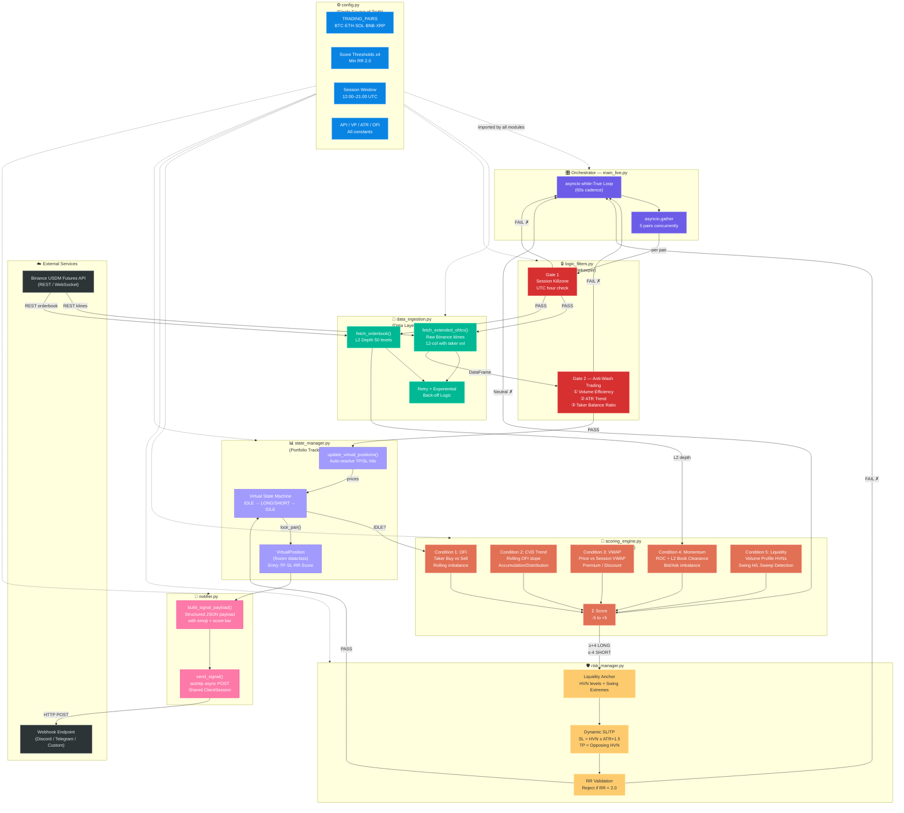

# 🐾 Neko Signal — Enterprise Multi-Pair Futures Signal Engine

> An enterprise-grade, fully asynchronous, bidirectional trading signal framework for **Binance USDM Futures**. Built on market microstructure, volume profile analysis, and order flow imbalance.

---

## 📐 Architecture Diagram



---

## 🚀 Quick Start

### 1. Clone & Install
```bash
git clone <your-repo-url> neko-signal
cd neko-signal

python -m venv venv
source venv/bin/activate        # Windows: venv\Scripts\activate

pip install -r requirements.txt
```

### 2. Configure
Edit [config.py](config.py) and set your webhook URL:
```python
WEBHOOK_URL: Final[str] = "https://hooks.example.com/your-actual-webhook"
```

> For **private order execution**, set `api_key` and `api_secret` when calling `create_exchange()` in [main_live.py](main_live.py). Public data endpoints (OHLCV, orderbook) work without credentials.

### 3. Run
```bash
python main_live.py
```

Logs are written to both **stdout** and `neko_signal.log`.

---

## 📦 Module Reference

| File | Role | Key Exports |
|---|---|---|
| [config.py](config.py) | Configuration hub | All constants & thresholds |
| [data_ingestion.py](data_ingestion.py) | Data layer | `fetch_extended_ohlcv()`, `fetch_orderbook()` |
| [logic_filters.py](logic_filters.py) | Gatekeeper | `gate_session_killzone()`, `gate_anti_wash_trading()` |
| [scoring_engine.py](scoring_engine.py) | Alpha brain | `compute_score()` → `int [-5, +5]` |
| [risk_manager.py](risk_manager.py) | Execution guard | `calculate_risk_params()` → `RiskParams \| None` |
| [state_manager.py](state_manager.py) | Portfolio tracker | `StateManager`, `VirtualPosition`, `PairState` |
| [notifier.py](notifier.py) | Comms layer | `build_signal_payload()`, `send_signal()` |
| [main_live.py](main_live.py) | Orchestrator | `run_scanner()` |

---

## ⚙️ Configuration Cheatsheet

| Constant | Default | Description |
|---|---|---|
| `TRADING_PAIRS` | 5 pairs | BTC, ETH, SOL, BNB, XRP (USDM Perp) |
| `SESSION_START_UTC` | `12` | 12:00 UTC = 19:00 VN Time (Killzone open) |
| `SESSION_END_UTC` | `21` | 21:00 UTC = 04:00 VN Time (Killzone close) |
| `SCORE_LONG_THRESHOLD` | `+4` | Minimum score to emit a LONG signal |
| `SCORE_SHORT_THRESHOLD` | `-4` | Maximum score to emit a SHORT signal |
| `MIN_RR_RATIO` | `2.0` | Signals with RR < 2.0 are rejected |
| `ATR_SL_MULTIPLIER` | `1.5` | ATR padding applied to the Stop-Loss |
| `OHLCV_LIMIT` | `500` | Candles fetched per cycle (~8h on 1m TF) |
| `LOOP_INTERVAL_S` | `60.0` | Seconds between full scan cycles |
| `VP_BINS` | `30` | Price bins for Volume Profile |
| `CVD_WINDOW` | `20` | Rolling window for CVD accumulation |

---

## 🧠 Signal Pipeline (Gate → Score → Risk → Notify)

```
Clock tick (every 60s)
        │
        ▼
┌── Gate 1: Session Killzone ──────────────────────────────────┐
│   Is UTC hour within [12:00, 21:00)?                         │
│   NO  → skip cycle entirely                                  │
│   YES → continue ──────────────────────────────────────────▶│
└──────────────────────────────────────────────────────────────┘
        │
        ▼ (fetch OHLCV + orderbook concurrently)
┌── Gate 2: Anti-Wash Trading ─────────────────────────────────┐
│   ① |Close-Open|/Volume ≥ MIN_VOLUME_EFFICIENCY?             │
│   ② ATR ≥ ATR 24-bar MA (volatility expanding)?              │
│   ③ Taker Buy % outside 49–51% band?                         │
│   ANY FAIL → reject candle                                   │
└──────────────────────────────────────────────────────────────┘
        │
        ▼
┌── State Update ──────────────────────────────────────────────┐
│   Check open virtual positions against current prices.       │
│   Auto-unlock (IDLE) if TP or SL is breached.               │
└──────────────────────────────────────────────────────────────┘
        │
        ▼
┌── Scoring Engine (5 conditions × ±1) ───────────────────────┐
│   C1 OFI        Rolling Taker Buy vs Sell imbalance          │
│   C2 CVD Trend  Slope of rolling OFI accumulation           │
│   C3 VWAP       Close vs session VWAP (premium/discount)    │
│   C4 Momentum   5-bar ROC + L2 bid/ask clearance            │
│   C5 Liquidity  HVN zone + Swing H/L sweep detection        │
│                                                              │
│   Score = Σ(C1..C5) ∈ [-5, +5]                             │
└──────────────────────────────────────────────────────────────┘
        │
        ├── Score ≥ +4 → LONG
        ├── Score ≤ -4 → SHORT
        └── Otherwise  → no signal (skip)
        │
        ▼
┌── Risk Manager ──────────────────────────────────────────────┐
│   SL = nearest HVN on loss side ± ATR×1.5                   │
│   TP = nearest opposing HVN / swing extreme                  │
│   RR = |TP-Entry| / |Entry-SL|                              │
│   RR < 2.0 → REJECT                                         │
└──────────────────────────────────────────────────────────────┘
        │
        ▼
┌── State Manager: lock pair (IDLE → LONG/SHORT) ─────────────┐
└──────────────────────────────────────────────────────────────┘
        │
        ▼
┌── Notifier: POST JSON payload to webhook ────────────────────┐
│   { pair, direction, entry, TP, SL, RR, score, emoji }      │
└──────────────────────────────────────────────────────────────┘
```

---

## 📊 Scoring Conditions Deep Dive

### Condition 1 — Order Flow Imbalance (OFI)
$$\text{OFI} = V_{\text{takerBuy}} - V_{\text{takerSell}}$$

Rolling mean over last `OFI_WINDOW` candles. Positive → sustained buy-side aggression → **+1**.

### Condition 2 — CVD Trend
$$\text{CVD}_t = \sum_{i=t-N}^{t} \text{OFI}_i$$

Compares current CVD to its midpoint value. Rising slope → accumulation → **+1**.

### Condition 3 — VWAP Premium / Discount
$$\text{VWAP} = \frac{\sum P_{\text{typical}} \times V}{\sum V}, \quad P_{\text{typical}} = \frac{H+L+C}{3}$$

Price above VWAP → institutional premium → **+1**. Below → discount → **-1**.

### Condition 4 — Momentum + Orderbook Clearance
$$\text{ROC} = \frac{C_t - C_{t-5}}{C_{t-5}}$$

Combined with bid/ask depth imbalance within ±0.5% of mid-price. Both must agree.

### Condition 5 — Liquidity Zones
- **Sweep Detection**: Wick above swing high + close below → bearish (-1). Wick below swing low + close above → bullish (+1).
- **HVN Interaction**: Price near a High Volume Node (≥75th volume percentile) → support/resistance tag.

---

## 🔒 Anti-Wash Trading Logic

The three sub-filters of Gate 2 are designed to reject candles generated by market manipulation:

| Sub-Filter | Formula | Rejects When |
|---|---|---|
| Volume Efficiency | `\|Close-Open\| / Volume` | `< 0.0002` (no price displacement) |
| ATR Trend | `ATR_14` vs `SMA(ATR_14, 24)` | ATR is contracting (dead market) |
| Taker Balance | `TakerBuy / TotalVolume` | Between 49% and 51% (algo-printed volume) |

---

## 📡 Webhook Payload Format

```json
{
  "schema_version": "1.0",
  "system": "Neko Signal",
  "timestamp_utc": "2026-02-26T19:05:00+00:00",
  "signal": {
    "pair": "BTCUSDT",
    "direction": "LONG",
    "emoji": "🟢 LONG",
    "entry_price": 95000.12345678,
    "take_profit": 97500.00000000,
    "stop_loss":   94000.00000000,
    "risk_reward": 2.083,
    "score": 4,
    "score_label": "+4/5",
    "score_bar": "████░"
  },
  "meta": {
    "session": "US Killzone",
    "strategy": "Market Microstructure + Volume Profile"
  }
}
```

---

## 🛠️ Tech Stack

| Library | Version | Purpose |
|---|---|---|
| `ccxt` | ≥ 4.2.0 | Exchange connectivity (async Binance USDM) |
| `pandas` | ≥ 2.1.0 | Vectorised OHLCV processing |
| `numpy` | ≥ 1.26.0 | High-performance numerical computation |
| `aiohttp` | ≥ 3.9.0 | Async HTTP client for webhook delivery |
| `asyncio` | stdlib | Concurrent pair scanning |

---

## 📝 Coding Standards

- **PEP 8** compliant throughout.
- **Type hints** (PEP 484) on every function signature and module-level variable.
- **Google-style docstrings** on every public function and class.
- **Vectorisation-first**: no Python loops in hot paths — all signal logic uses NumPy/Pandas operations.
- **No hard-coded values**: every tunable parameter lives in `config.py`.
- **Separation of Concerns**: each module has exactly one responsibility.

---

## 📄 License

MIT — see `LICENSE` for details.

---

*Built with 🐾 by the Neko Signal team.*
